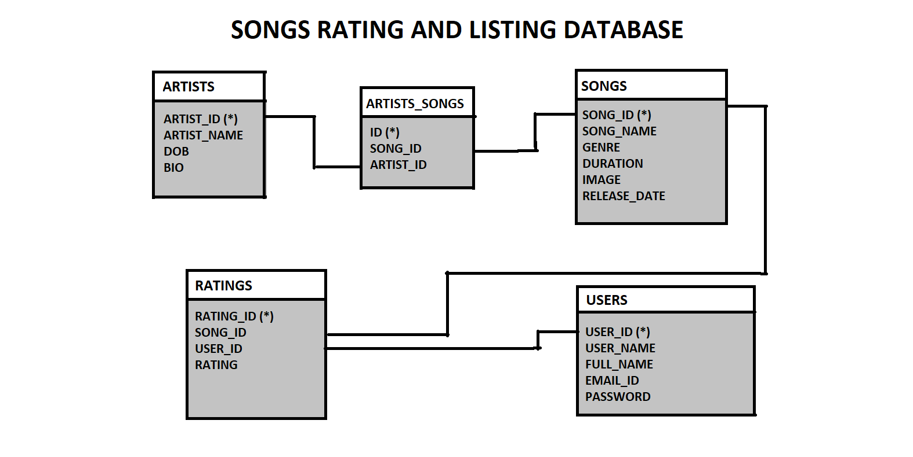
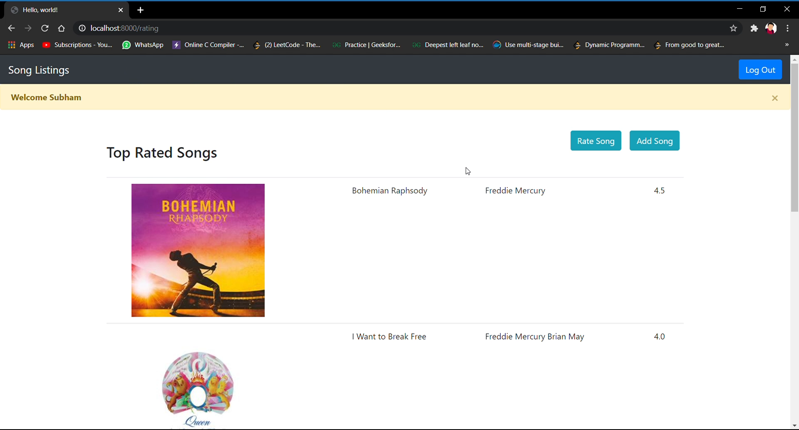
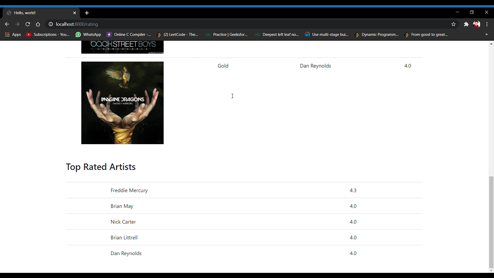

# Songs Listing Website

In this website users can add their favourite artists and songs and rate them and according to ratings home page will show top 10 songs and artists with their ratings.

This website is developed using Django web framework

## The Database Schema used here is as follows

I have also added the DML, DDL sql files which I used to Test the database



# Instructions

First clone this repo to your machine , then run go to the project directory.
Then run this following command

```
pip install -r requierments.txt
```

It will install all necessary packages

In the last commit I have added Dockerfile and docker-compose

to run them use following command

```
docker-compose up --build
```

And if incase it doesn't Work just cmake a small change in settings.py 

Under Database configs change HOST = '127.0.0.1'

And then you can run it on localhost

The command for that is

```
python manage.py runserver
```

# Some screenshots of the project 




